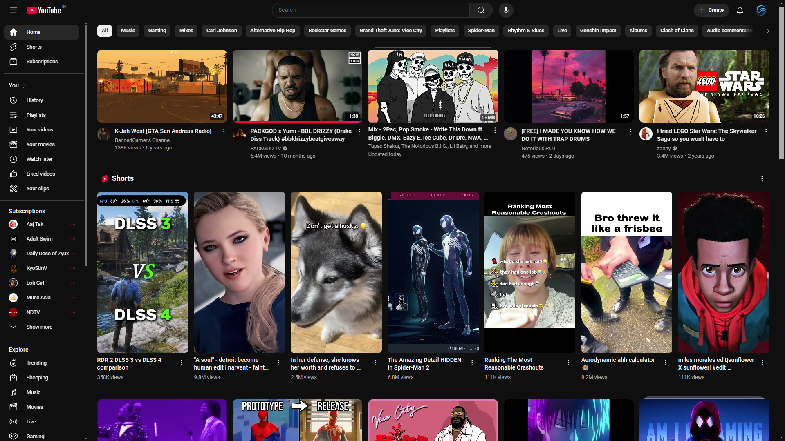
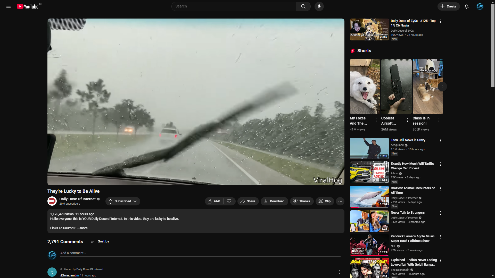

#  AntiShort - Block YouTube Shorts

**AntiShort** is a lightweight Chrome extension that automatically hides YouTube Shorts from your feed and video sidebar, giving you a cleaner and distraction-free browsing experience.

## 🚀 Features

- Removes Shorts from the homepage.
- Hides Shorts from the video sidebar.
- Works dynamically with YouTube's SPA (Single Page Application) reloads.
- Lightweight and efficient (runs only when needed).

## 📦 Installation

1. Download the zip by following this link: https://github.com/OnceYT/AntiShort/archive/refs/tags/v1.0.zip
2. Extract the zip file.
3. Open **Chrome** and go to `chrome://extensions/`.
4. Enable **Developer Mode** (toggle in the top-right corner).
5. Click **Load unpacked** and select the `AntiShort-1.0` folder inside the extracted `AntiShort-1.0` folder.
6. Enjoy a Shorts-free YouTube experience! 🎉

## ⚙️ How It Works

The extension hides Shorts using a combination of CSS selectors and a MutationObserver to detect dynamically loaded elements. It automatically:

- Finds Shorts-related sections and removes them.
- Watches for changes in the YouTube DOM to hide new Shorts elements as they appear.

## 📷 Screenshots

| Homepage (Before) | Homepage (After) |
|------------------|----------------|
|  |  |

| Sidebar (Before) | Sidebar (After) |
|-----------------|----------------|
|  |  |

---

### 🔗 [GitHub Repository](https://github.com/OnceYT/AntiShort)

Made with ❤️ to improve your YouTube experience. If you find this extension useful, consider giving it a ⭐!
